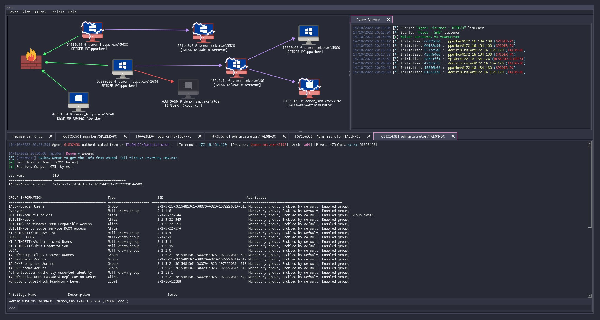

<div align="center">
  
  <h1>Havoc</h1>
  <br/>

  <p><i>Havoc is a modern and malleable post-exploitation command and control framework, created by <a href="https://twitter.com/C5pider">@C5pider</a>.</i></p>
  <br />

  <br />
  <br />
  
</div>

### Quick Start

> Please see the [Wiki](https://github.com/HavocFramework/Havoc/wiki) for complete documentation.

Havoc works well on Debian 10/11, Ubuntu 20.04/22.04, Kali Linux, and **macOS** (Apple Silicon and Intel). You'll need a modern version of Qt5 and Python 3 to avoid build issues.

See the [Installation](#installation) section below for macOS-specific instructions.

If you run into issues, check the [Known Issues](https://github.com/HavocFramework/Havoc/wiki#known-issues) page as well as the open/closed [Issues](https://github.com/HavocFramework/Havoc/issues) list.

---

### Features

#### Client

> Cross-platform UI written in C++ and Qt5 — runs on Linux, macOS (Intel & Apple Silicon), and Windows

- Modern, dark theme based on [Dracula](https://draculatheme.com/)
- **Android client** — native Kotlin/Compose app to control the teamserver from any Android device
  - Connect to teamserver, manage sessions, run commands, manage listeners, generate payloads
  - Full session console with all Demon commands available on mobile

#### Teamserver

> Written in Golang

- Multiplayer
- Payload generation (exe/shellcode/dll)
- HTTP/HTTPS listeners
- Customizable C2 profiles
- External C2
- **Cross-platform build support** — macOS and Linux teamserver builds via Homebrew MinGW
- **Linux & macOS agent builder** — compiles DemonPosix using `zig cc` with musl (no cross-compiler needed)
- **Android APK builder** — builds the DemonAndroid APK via Gradle with C2 config baked in

#### Demon (Windows)

> Havoc's flagship Windows agent written in C and ASM

- Sleep Obfuscation via [Ekko](https://github.com/Cracked5pider/Ekko), Ziliean or [FOLIAGE](https://github.com/SecIdiot/FOLIAGE)
- x64 return address spoofing
- Indirect Syscalls for Nt* APIs
- SMB support
- Token vault
- Variety of built-in post-exploitation commands
- Patching Amsi/Etw via Hardware breakpoints
- Proxy library loading
- Stack duplication during sleep

#### DemonPosix (Linux & macOS)

> POSIX agent written in C — targets Linux (x64/arm64) and macOS (Intel/Apple Silicon)

- **HTTP/HTTPS transport** via libcurl (macOS) or raw POSIX sockets / `zig cc` + musl (Linux cross-build)
- **Fully static Linux binaries** — zero runtime dependencies, runs on any distribution
- **File system commands** — ls, cd, pwd, cat, mkdir, rm, cp, mv, upload, download
- **Process management** — list processes, kill by PID
- **Shell execution** — arbitrary command execution via `sh -c`
- **Process injection** — `ptrace` + remote `mmap` on Linux; `task_for_pid` + Mach VM on macOS
- **Persistence** — cron, systemd user service (Linux), LaunchAgent plist (macOS), bashrc/zshrc
- **Pivoting** — UNIX domain socket pivot channel (equivalent to Windows SMB named pipe)
- **Sleep obfuscation** — `mprotect`-based memory protection during sleep (Linux)
- **Anti-debug / sandbox checks** — TracerPID detection, VM fingerprinting, process masquerade via `prctl`
- **AES-256 CBC** — pure-C implementation, no OpenSSL dependency
- **Identical wire format** — same binary C2 protocol as the Windows Demon; same teamserver handles all agents

**Build targets:**

| Format | Architecture | Notes |
|--------|-------------|-------|
| Linux Exe | x64, arm64 | Static ELF via `zig cc -target x86_64-linux-musl` |
| Linux SO | x64, arm64 | Shared library for LD_PRELOAD injection |
| macOS Exe | x64, arm64 | Mach-O binary via system clang |
| macOS Dylib | x64, arm64 | Dynamic library |
| Android Exe | arm64, x64 | Static ELF runs on Android without NDK |
| Android SO | arm64, x64 | Shared library for Android injection |
| Android APK | arm64 | Full APK via DemonAndroid (see below) |

#### DemonAndroid (Android APK)

> Native Kotlin agent compiled as an installable APK

- **ForegroundService** beacon loop — survives app closure, runs continuously in background
- **Persistence** — `BOOT_COMPLETED` receiver restarts the service after every reboot
- **HTTP/HTTPS transport** — OkHttp with self-signed cert bypass
- **Identical Havoc wire protocol** — AES-256 CBC, same binary framing, same teamserver
- **Commands** — shell, ls, cd, pwd, cat, mkdir, rm, upload, download, process list, whoami, sleep, exit
- **Disguise** — configurable APK package name and app label (e.g. `com.android.systemsync` / "System Sync")
- **Notification** — minimal "Syncing" notification (no app icon in recents, no history)
- C2 host/port/URI/SSL baked in at build time via Gradle `-P` properties

**Session table shows:** `Android 14 (API 34)` in the OS column

<div align="center">
  <br />
</div>

#### Extensibility

- [External C2](https://github.com/HavocFramework/Havoc/wiki#external-c2)
- Custom Agent Support
  - [Talon](https://github.com/HavocFramework/Talon)
- [Python API](https://github.com/HavocFramework/havoc-py)
- [Modules](https://github.com/HavocFramework/Modules)

---

### Installation

#### Linux (Debian/Ubuntu/Kali)

```bash
# Install dependencies
sudo apt install -y golang-go nasm mingw-w64 python3-dev libqt5websockets5-dev \
  qtbase5-dev qt5-qmake cmake

# Clone and build
git clone https://github.com/HavocFramework/Havoc
cd Havoc
make         # builds both teamserver and client
```

#### macOS (Apple Silicon & Intel)

```bash
# Install dependencies via Homebrew
brew install qt@5 golang nasm mingw-w64 cmake python3

# Optional — for cross-compiling Linux/Android agents:
brew install zig

# Optional — for Android APK generation:
brew install --cask android-commandlinetools
brew install openjdk@17
sdkmanager "build-tools;34.0.0" "platforms;android-34"

# Clone and build
git clone https://github.com/HavocFramework/Havoc
cd Havoc
make ts-build      # teamserver only
make client-build  # GUI client only
make               # both
```

> The macOS build uses Homebrew's `mingw-w64` for cross-compiling the Windows Demon agent.
> The profile at `profiles/havoc.yaotl` is pre-configured for Homebrew paths.

#### Android Client (Operator App)

The Android operator client lives in `android/`. Open it in Android Studio, build and run on your device.

Requirements: Android Studio Hedgehog+, Android SDK 34, minSdk 26.

---

### Agent Platform Support

| Agent | Targets | Transport | Notes |
|-------|---------|-----------|-------|
| Demon | Windows x64/x86 | HTTP/HTTPS, SMB | Original flagship agent |
| DemonPosix | Linux x64/arm64, macOS x64/arm64 | HTTP/HTTPS | Static musl build via `zig cc`; libcurl on macOS |
| DemonAndroid | Android arm64/x64 | HTTP/HTTPS | APK; ForegroundService; persists on reboot |

---

### Community

You can join the official [Havoc Discord](https://discord.gg/z3PF3NRDE5) to chat with the community!

### Note

Please do not open any issues regarding detection.

The Havoc Framework hasn't been developed to be evasive. Rather it has been designed to be as malleable & modular as possible. Giving the operator the capability to add custom features or modules that evades their targets detection system.
